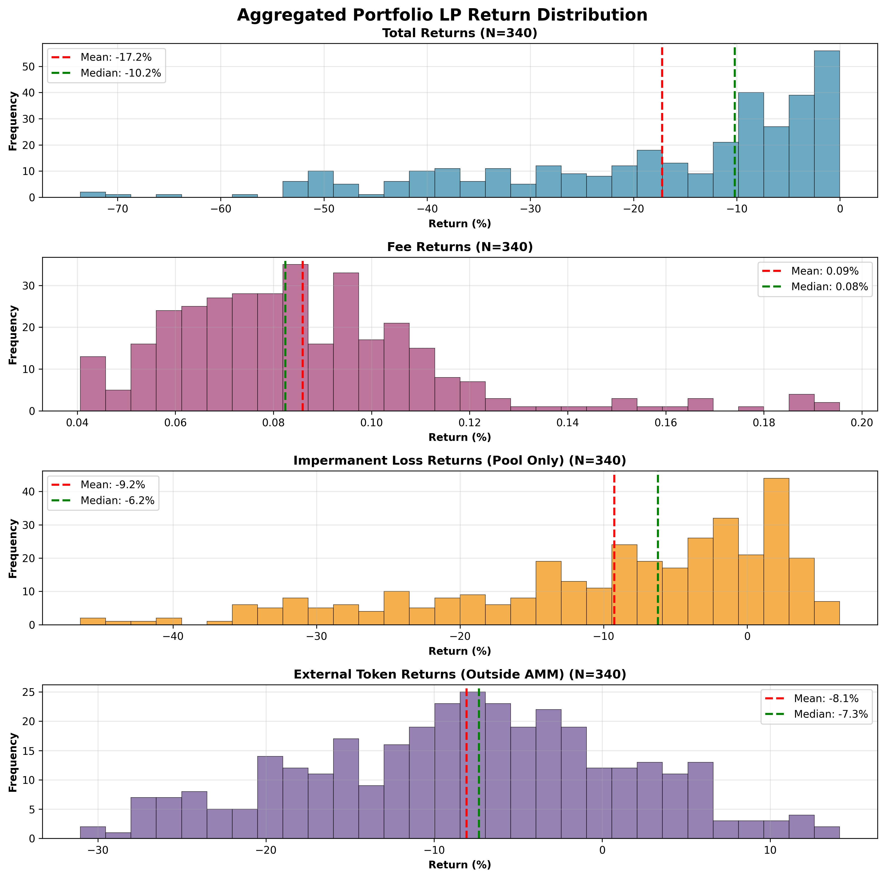

## Market Structure  
Each market contains UP and DOWN tokens representing directional bets on chain TVL changes:
- **UP tokens** increase in value when chain TVL grows above the starting level
- **DOWN tokens** increase in value when chain TVL falls below the starting level  
- Token prices are determined by a piece-wise linear mapping based on TVL ratio (Current TVL / Starting TVL)
- UP and DOWN prices always sum to $1.00, creating a complementary pair

## Liquidity Pool Mechanics
- **Initial setup**: 1 UP and 1 DOWN token minted per simulation
- **AMM model**: Constant product (Uniswap v2 style) with equal USD value deposited initially
- **Price updates**: Daily based on actual TVL changes

## Understanding LP Return Components

**Total Returns**: Your complete profit/loss as an LP, combining all effects below

# LP Return Distribution
- The below reflects the simulated % return from depositing liquidity into these pools, based on historical data.

## Important
- **Take note of the mean and median total returns in the below reports**

## Portfolio Performance


# Technical Implementation

## Configuration Parameters
The simulation can be configured via the `SimulationConfig` class:
```python
analysis_months: int = 12                    # Historical data period
simulation_period_days: int = 21             # Length of each LP position
period_spacing_days: int = 1                 # Days between simulation starts  
fee_rate: float = 0.003                      # 0.3% trading fee
withdrawal_enabled: bool = False             # No early withdrawal strategy
withdrawal_timing_pct: float = None          # Timing for withdrawal (if enabled)
withdrawal_amount_pct: float = None           # Amount to withdraw (if enabled)
top_evm_chains: ["Arbitrum", "Base", "Unichain"]  # Analyzed chains
```

## Code Repository
...

# Disclaimer

This analysis is for informational purposes only and does not constitute financial advice. The results are based on historical data and may not reflect future performance. The simulation code and models may contain errors, bugs, or inaccuracies that could affect the reliability of the results.