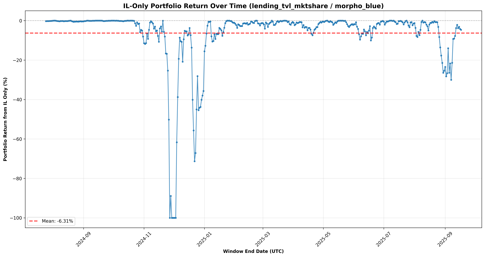

# LP IL-Only Report — `lending_tvl_mktshare` / `morpho_blue`

_Windows strictly earlier than **2025-09-18**. All figures exclude trading fees._

## Data Source
**Metric which market is forecasting:** Morpho Blue lending TVL share as of Oct 1, 2025

<details><summary>Oracle Question used to resolve metric value</summary>

Use the DefiLlama lending protocol endpoint at https://api.llama.fi/protocol/morpho-blue. Extract the TVL (totalLiquidityUSD) series and return the value with the greatest timestamp at or before 2025-10-01 00:00:00 UTC (UTC). For the denominator, rank all lending protocols from https://api.llama.fi/protocols by their TVL value (totalLiquidityUSD) at 2025-10-01 00:00:00 UTC (UTC), pick the top 12, and sum those TVL values at that same timestamp.Compute the Morpho Blue lending TVL share as (protocol TVL / aggregate lending TVL) * 100 and report that percentage * 100, rounded up to the nearest integer.

</details>

## Market Structure
Each market contains **UP** and **DOWN** tokens representing directional bets on changes in the underlying metric:
- **UP tokens** increase in value when the metric rises above its starting level
- **DOWN tokens** increase in value when the metric falls below its starting level
- Token prices are obtained by a piece-wise linear mapping of the metric into a bounded range; the UP price is the scaled value and the DOWN price is `1 − UP`
- UP and DOWN prices always sum to **$1.00**, forming a complementary pair

## Price Mapping
- Market bounds: **min = 7.6**, **max = 13**. UP's USD price p is a linear mapping of the metric m into [0,1].
- Mapping: we scale the metric between min and max to get a number p between 0 and 1 (values below min map to 0; above max map to 1)
- DOWN's USD price is 1 − p
- AMM pool price (UP:DOWN) = p / (1 − p)
- Intuition: when the metric rises (p ↑), UP becomes more valuable relative to DOWN, so the pool price p/(1−p) increases; the LP's inventory rebalances toward DOWN and vice versa
- Impermanent loss depends on how far the pool price moves away from the starting price at your deposit; larger moves ⇒ larger IL (fees excluded here)

### Worked Example (for intuition)
- Take m at 60% of range: m = min + 0.60 × (max − min) = 10.84
- UP price: p = (m − min) / (max − min) = (10.84 − 7.6) / (13 − 7.6) = **0.600**
- AMM pool price (UP:DOWN): p/(1 − p) = 0.600 / 0.400 = **1.500**


## Liquidity Pool Mechanics
- **Initialization**: UP and DOWN are minted in **equal proportion** before depositing to the pool
- **AMM model**: Constant product (Uniswap v2 style) with equal notional value deposited initially
- **Ratio mismatch & leftovers**: Because the AMM requires a specific price ratio, one side is typically over-minted. The excess remains **un-deposited** ("leftover") and is carried passively to the end of the period
- **Pricing updates**: Prices evolve as the underlying metric changes; UP and DOWN continue to sum to $1.00

# LP Return Distribution
We simulate starting at each historical window strictly earlier than the cutoff date. 
We **exclude** very early windows until a minimum history (processing.min_historical_data_months) has elapsed to avoid unstable bounds.

## Important
- **Mean** -20.30% and **median** -10.74% IL-only returns are shown below.
- These IL losses must be compared to incentive APY to calculate your net returns.

## Portfolio Performance
### IL Distribution Histogram


### IL Over Time


This time series shows how IL-only portfolio returns have varied across different historical windows.

### Distribution Summary (IL-only, %)

- Count: **407**
- Mean: **-20.30%**, Std: **21.52%**
- Median: **-10.74%**  |  P25: **-37.05%**  |  P10: **-45.24%**  |  P75: **-2.71%**

## Calculating Your Net APY

To determine your actual returns, combine Merkl incentive APY with these IL losses:

**Period Factor**: 0.036 (since this is a 13-day market)

### Formula:
```
Period_Factor = Market_Duration_Days / 365
Incentive_Multiplier = 1 + (Merkl_APY × Period_Factor)
Net_Return = Incentive_Multiplier × (1 + IL_Return) - 1
```

Where:
- **Period_Factor**: Scales annual incentive APY to the market duration
- **Merkl_APY**: The annual percentage yield from Merkl incentives (as a decimal)
- **IL_Return**: Your expected impermanent loss return (as a decimal, typically negative)

### Example Calculation (Hypothetical Numbers Only):
**Example calculation only**: Let's say Merkl shows **200% APY** (this is just an example - actual APY varies by market) and you experience the **median IL loss (-10.74%)**:

1. **Scale Merkl APY to period**: 200% × 0.036 = 7.1%
2. **Convert to multiplier**: 1 + 7.1% = 1.071
3. **Apply median IL loss**: 1.071 × (1 + -10.7%) = 1.071 × 0.893 = 0.956
4. **Net return for 13 days**: -4.4%
5. **Annualized (APY)**: (0.956)^28.1 - 1 = **-71.6% APY**

**Steps to use this with your actual numbers:**
1. Find your market's Merkl campaign and note the **actual APY** (not the 200% example)
   - **Note**: Merkl APY can vary over the duration of the market depending on the amount of liquidity provided
2. Multiply that APY by **0.036**
3. Add 1 to get the incentive multiplier
4. Multiply by (1 + your_expected_IL_return)
5. Subtract 1 to get your net return over 13 days
6. To annualize: raise (1 + return) to the power of 28.1, then subtract 1

# Technical Implementation

## Outputs
- **CSV (per-window IL)**: [il_by_window.csv](il_by_window.csv)

# Disclaimer
This analysis is for informational purposes only and does not constitute financial advice. Results are based on historical data and may not reflect future performance. Simulation code and models may contain errors or inaccuracies.