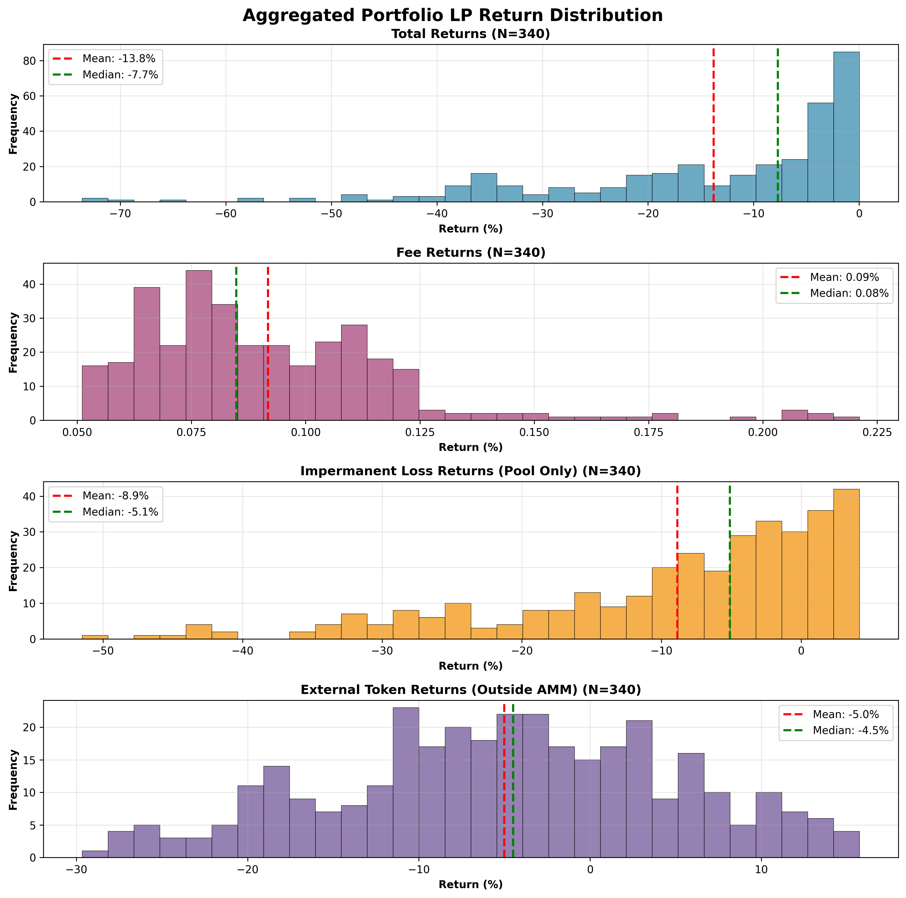
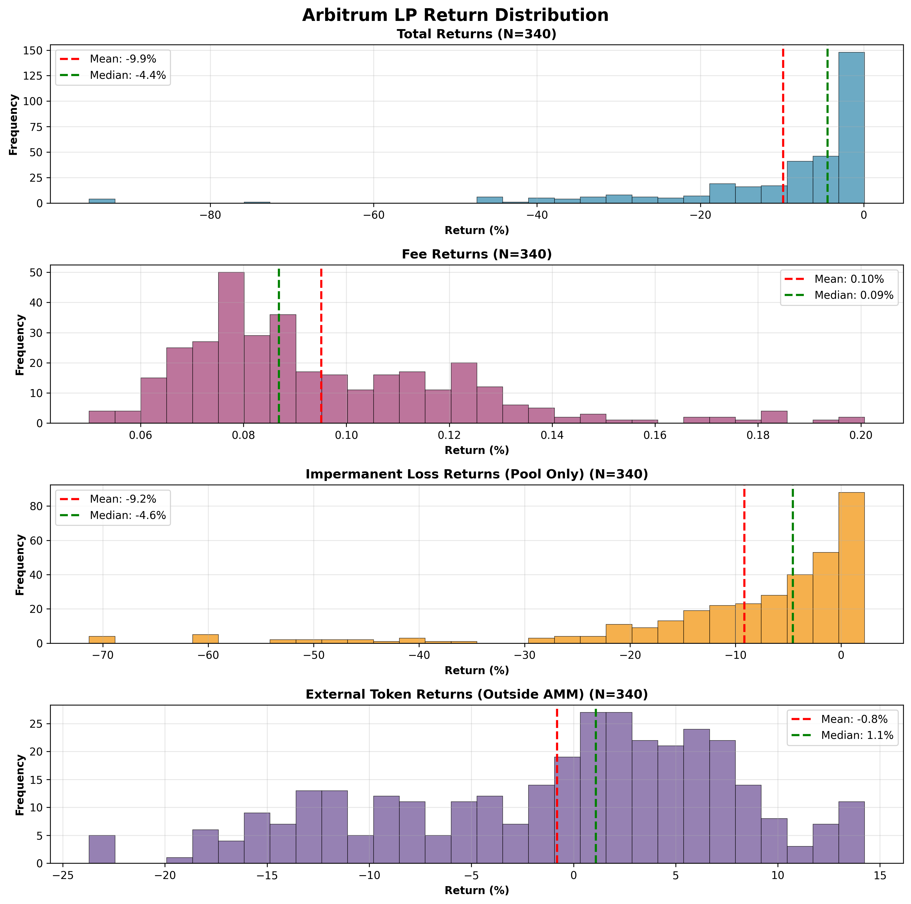
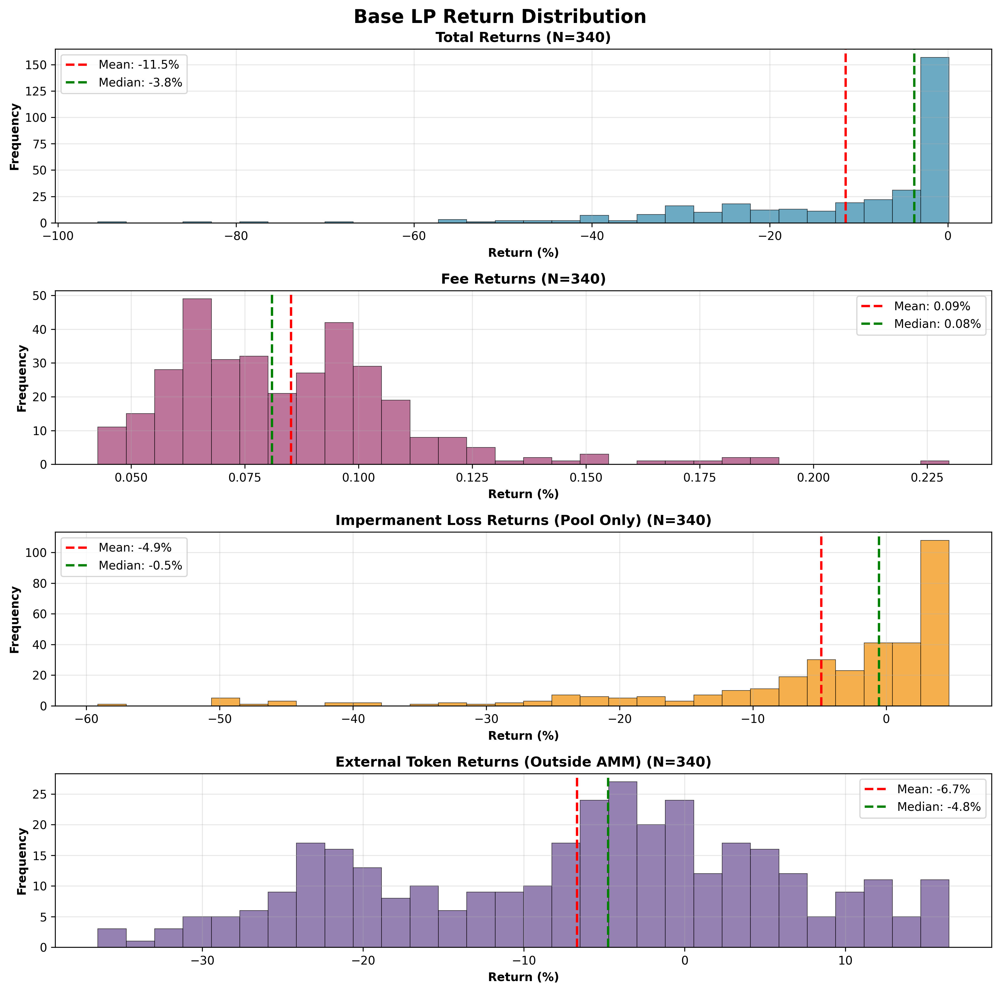
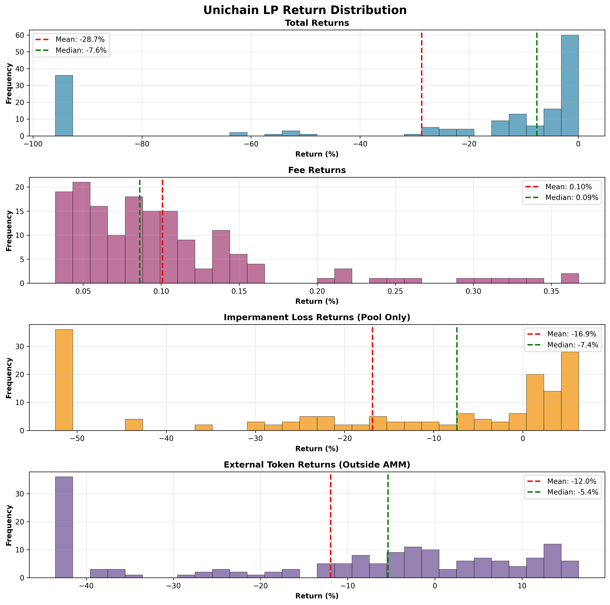

# Liquidity Provider Return Analysis - Methodology Report  
  
## Overview  
This report analyzes the expected returns for liquidity providers (LPs) in chain TVL futures markets using historical backtesting over 12 months of data across Arbitrum, Base, and Unichain.  
  
# Methodology  
  
## Market Structure  
Each market contains UP and DOWN tokens representing directional bets on chain TVL changes:
- **UP tokens** increase in value when chain TVL grows above the starting level
- **DOWN tokens** increase in value when chain TVL falls below the starting level  
- Token prices are determined by a piece-wise linear mapping based on TVL ratio (Current TVL / Starting TVL)
- UP and DOWN prices always sum to $1.00, creating a complementary pair

## Data and Sampling  
- **Historical TVL data**: 12 months (if sufficient data) from Arbitrum, Base, and Unichain
- **Simulation periods**: 21-day intervals with 1-day spacing between start dates  
- **Total periods analyzed**: 340 rolling windows

## Liquidity Pool Mechanics
- **Initial setup**: 1,000 UP and 1,000 DOWN tokens minted per simulation
- **AMM model**: Constant product (Uniswap v2 style) with equal USD value deposited initially
- **Fee structure**: 0.3% trading fee on all transactions
- **Price updates**: Daily based on actual TVL changes
- **Fee calculation**: Based on implied trading volume from token rebalancing

## Portfolio Construction  
- **Allocation**: Equal-weighted exposure across Arbitrum, Base, and Unichain
- **Risk management**: Liquidity kept in pool over full duration of period
- **Return calculation**: Portfolio returns averaged across the three markets

## Understanding LP Return Components

**Total Returns**: Your complete profit/loss as an LP, combining all effects below

**Fee Component**: Revenue earned from trading fees (0.3% per trade)
- Positive by design - you earn fees when traders swap tokens
- Averages ~0.09% per 21-day period across all chains
- Conservative estimate assuming only daily price updates

**Impermanent Loss (IL) Component**: Loss from AMM token rebalancing  
- Occurs when UP/DOWN token prices change from their starting 50/50 ratio
- Calculated as the difference between holding tokens in the AMM vs. holding them separately
- Primary driver of negative returns, averaging -8.87% per period

**External Token Component**: Value change of tokens held outside the AMM
- Some UP/DOWN tokens remain outside the pool after initial liquidity provision, due to depositing an unequal quantity of UP and DOWN tokens into pool but minting equal amounts of each token, hence having some left over.
- These tokens fluctuate in value based on TVL changes
- Contributes additional negative returns averaging -5.01% per period

# LP Return Distribution
- Important: Take note of the mean and median total returns in the below reports
- This corresponds to the % return you can expect to make by depositing liquidity into these pools. Does not include liquidity incentives provided via merkl.

## Aggregated Portfolio Performance
(corresponds to making an initial equal deposit into each pool)


## Individual Pool Performance

### Arbitrum TVL market pool returns


### Base TVL market pool returns


### Unichain TVL market pool returns


## Notes & Observations
- **Chain diversification matters**: Portfolio approach reduces risk compared to single-chain exposure, with Arbitrum showing the best individual performance
- **Unichain volatility**: Shows highest returns volatility and worst performance, reflecting its newer status and higher TVL fluctuations
- **Conservative fee estimates**: Actual trading frequency may be higher than daily, potentially improving fee revenue

# Technical Implementation

## Configuration Parameters
The simulation can be configured via the `SimulationConfig` class:
```python
analysis_months: int = 12                    # Historical data period
simulation_period_days: int = 21             # Length of each LP position
period_spacing_days: int = 1                 # Days between simulation starts  
fee_rate: float = 0.003                      # 0.3% trading fee
withdrawal_enabled: bool = False             # No early withdrawal strategy
withdrawal_timing_pct: float = None          # Timing for withdrawal (if enabled)
withdrawal_amount_pct: float = None           # Amount to withdraw (if enabled)
top_evm_chains: ["Arbitrum", "Base", "Unichain"]  # Analyzed chains
```

## Code Repository
- **Main simulation**: `src/defi_lp_portfolio_simulation.py`
- **Visualization generator**: `src/lp_visualization.py`  
- **Core utilities**: `src/lp_simulation_utils.py`
- **GitHub**: https://github.com/butterygg/lp_analysis


# Disclaimer

This analysis is for informational purposes only and does not constitute financial advice. The results are based on historical data and may not reflect future performance. The simulation code and models may contain errors, bugs, or inaccuracies that could affect the reliability of the results.